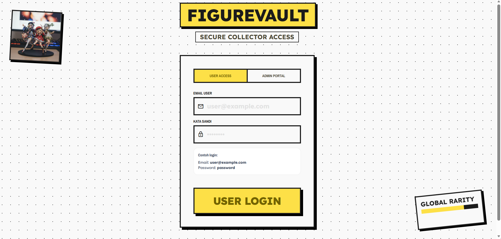
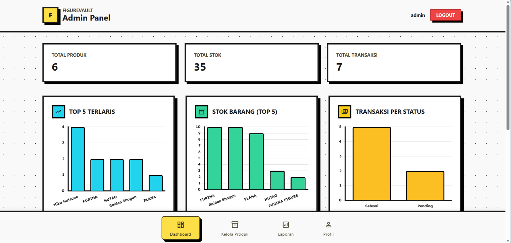
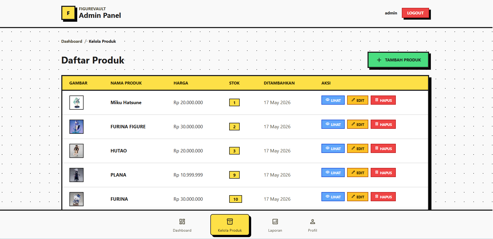
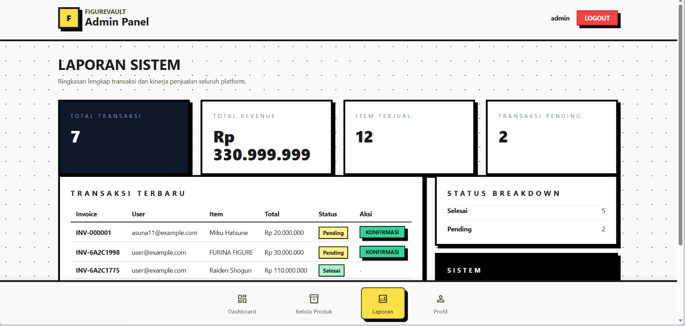
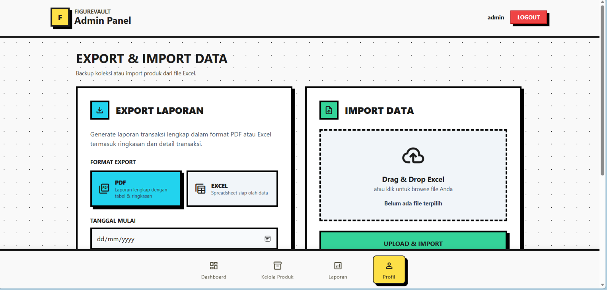
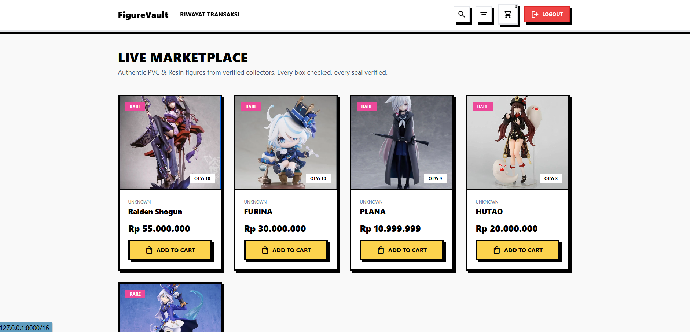
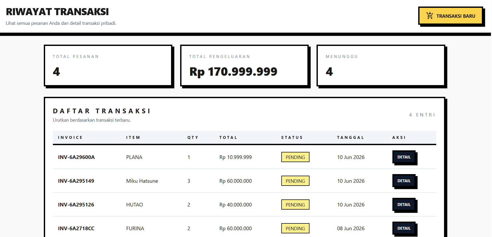
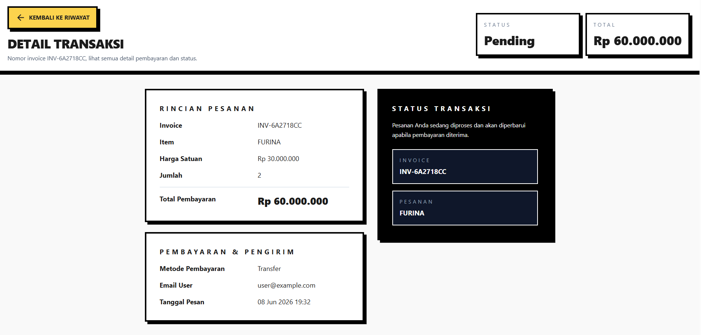
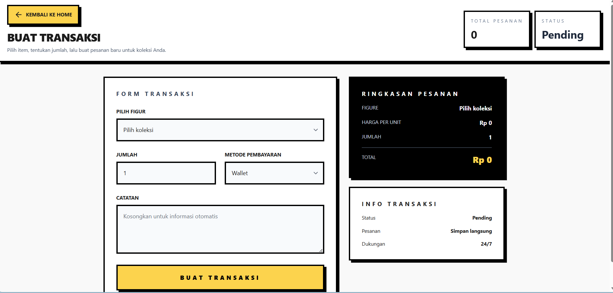

## Proyekk Laravel FigureVault

Ini adalah proyek laravel FigureVault

## Fitur Utama

* Autentikasi Admin
* Manajemen Produk (CRUD)
- Manajemen Transaksi
- Dashboard
- Laporan Penjualan
- Export/Import (PDF & Excel)
- Market User (katalog produk)
- Profil Pengguna
- Riwayat Transaksi

## Teknologi yang Digunakan

•	Laravel 
•	MySQL 
•	HTML, CSS, dan JavaScript 
•	Tailwind CSS 
•	Maatwebsite Excel 
•	DomPDF 

## Screenshot Login

## Screenshot Dashboard

## Screenshot Daftar Produk

## Screenshot Laporan

## Screenshot Profil

## Screenshot Market User

## Screenshot Riwayat

## Screenshot Detail

## Screenshot Transaksi

